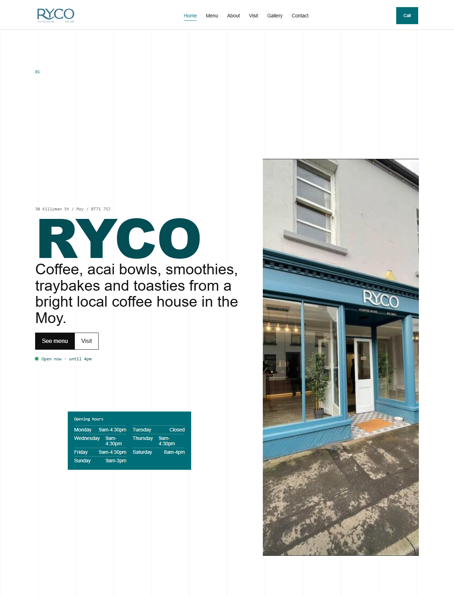
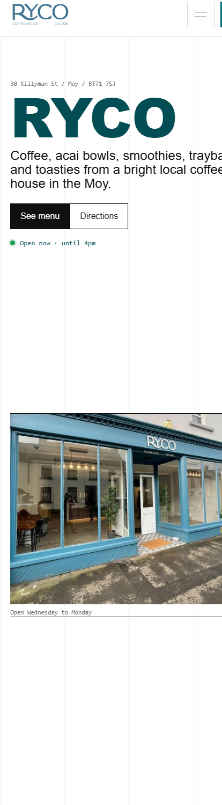
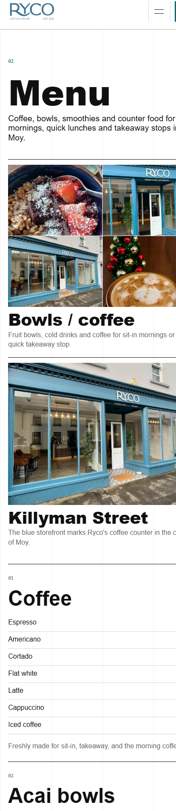

# RYCO Coffee House — Website

A fast, mobile-first marketing site for **RYCO Coffee House**, a coffee shop on
Killyman Street in Moy, Co. Tyrone. Built with React, TypeScript and Vite, and
deployed as a fully static site to GitHub Pages.

**Live:** https://chrismac860.github.io/ryco-coffee-house/

| Home (desktop) | Home (mobile) | Menu (mobile) |
| --- | --- | --- |
|  |  |  |

---

## The story

This is a real-business build, not a throwaway demo. RYCO is a genuine local
coffee shop, and the goal was a site that does the one job a small café actually
needs from the web: **show up cleanly when someone searches "coffee in Moy",
unfurl nicely when the shop shares a link on Facebook or Instagram, and load
instantly on a phone.**

Everything currently on the site was assembled from publicly available sources
(the shop's Facebook/Instagram, Restaurant Guru and Restaurantji listings) so
there was something concrete to react to. That means a few things are explicitly
**placeholders pending the owner's sign-off**, and they're flagged in the code:

- **Prices** are market-estimate placeholders (see the note in
  [`src/data/siteContent.ts`](src/data/siteContent.ts)) — to be replaced with
  RYCO's real prices.
- **Photography** uses public listing/social images
  (see [`public/images/README.md`](public/images/README.md)) — to be replaced
  with owner-approved originals.

Before this goes public or changes hands, the owner needs to give **written
permission** to use the brand/imagery and ideally a short **testimonial**. The
exact go-live steps are in [`docs/HANDOFF.md`](docs/HANDOFF.md).

---

## Tech stack

- **React 19** + **TypeScript**
- **Vite 7** build, **React Router 7** for routing
- **Vitest** + Testing Library (11 tests covering navigation, hours, menu and
  the desktop/mobile split)
- **GitHub Actions → GitHub Pages** for deploys (`.github/workflows/deploy.yml`)
- No UI framework — hand-written CSS in [`src/styles.css`](src/styles.css)

## Local development

```bash
npm install
npm run dev        # http://127.0.0.1:5173
npm test           # run the test suite
```

## Production build

```bash
npm run build      # type-check, client build, server build, then prerender
npm run preview    # serve the built site locally
```

The build output in `dist/` is what GitHub Pages serves.

---

## Architecture decision: the served HTML is not empty

> This section documents a deliberate engineering choice, because it's the kind
> of thing that's invisible until it costs you.

### The problem

A stock Vite + React app ships an HTML shell whose body is essentially:

```html
<div id="root"></div>
<script type="module" src="/assets/index-*.js"></script>
```

The page only has content **after** JavaScript downloads and runs. For an app
that's fine; for a **local business that is discovered through search and social
sharing, it's a real liability**:

- "View source" and many crawlers/link-preview bots see an empty page.
- Open Graph / Twitter unfurls can come back blank.
- First paint waits on the JS bundle.

For a café whose customers find it on Google and Facebook, that's the opposite
of what the site is for.

### The decision

Add a **build-time prerender (static site generation)** step instead of reaching
for a full SSR framework:

1. `vite build` produces the normal client bundle.
2. A second `vite build --ssr` compiles a tiny server entry
   ([`src/entry-server.tsx`](src/entry-server.tsx)).
3. [`scripts/prerender.mjs`](scripts/prerender.mjs) renders **every route** to
   static HTML with `react-dom/server` and writes one fully-populated file per
   route (`/`, `/menu`, `/about`, `/visit`, `/gallery`, `/contact`), each with
   its own `<title>`, meta description and canonical/Open-Graph URL.
4. In the browser, [`src/main.tsx`](src/main.tsx) **hydrates** that markup
   rather than re-rendering from scratch.

The result: every served page already contains the real content (business name,
address, opening hours, full priced menu) before a single line of app JS runs.

### Why this approach, and the trade-off

- **No server runtime.** GitHub Pages is a static host, so paying for SSR
  infrastructure would be wrong here. SSG gives crawler-complete HTML and a
  faster first paint at **zero hosting cost** — the right tool for a brochure
  site.
- **Hydration is kept clean on purpose.** The server has no viewport, so the
  prerender always renders the **mobile** layout, and the live "open now"
  status renders a stable placeholder until the browser mounts
  ([`src/App.tsx`](src/App.tsx)). Both choices guarantee the server markup and
  the browser's first render match exactly — no hydration mismatch warnings.
  The deliberate cost is that desktop visitors see a brief mobile-width paint
  before the layout upgrades. That's an acceptable trade because the audience is
  overwhelmingly mobile (local "near me" search), and it buys correct hydration
  plus fully crawlable content.
- **One switch to flip for go-live.** The deployment origin, base path and
  per-page SEO live in a single file,
  [`scripts/site.config.mjs`](scripts/site.config.mjs), so moving to a custom
  domain is a two-line change rather than a find-and-replace across the repo.

### Verify it yourself

```bash
npm run build
# served HTML now contains real content, not an empty <div id="root">:
grep -o '<title>[^<]*</title>' dist/menu/index.html      # -> Menu | RYCO Coffee House, Moy
grep -c "Killyman" dist/index.html                        # -> non-zero
```

---

## Going live

Custom domain, repo rename, and the owner permission/testimonial steps are
documented as a checklist in **[`docs/HANDOFF.md`](docs/HANDOFF.md)**.
